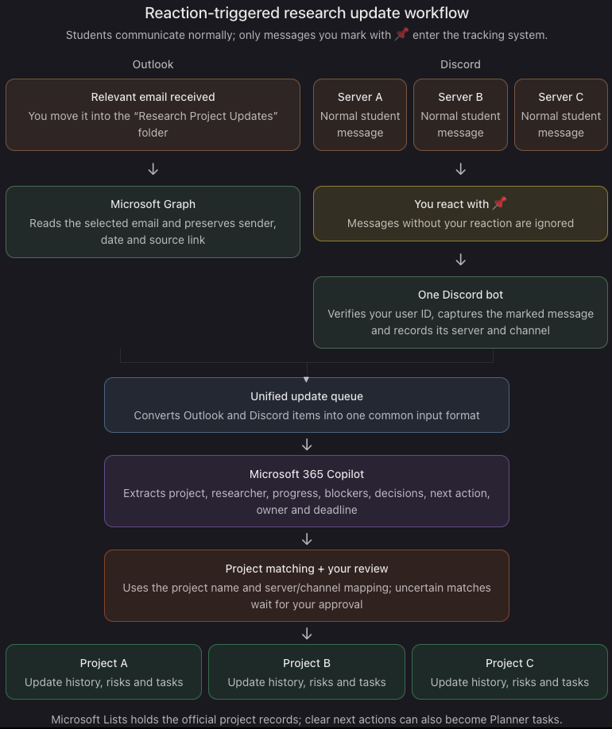

# update-aggregator-cpp

A system for collecting research progress updates from Outlook and multiple
Discord servers, processing them with Microsoft 365 Copilot, and organizing
them into the appropriate research projects.

## Planned Workflow

1. Microsoft Graph reads selected Outlook emails.
2. A Discord bot captures messages marked by the coordinator with a 📌 reaction.
3. Outlook and Discord updates enter a unified queue.
4. Copilot extracts progress, blockers, tasks, owners, and deadlines.
5. Each update is routed to the appropriate project.
6. Project records are stored in Microsoft Lists, with tasks optionally added
   to Microsoft Planner.

## Project Status

Planning and initial development.

## Planned Components

- Discord bot
- Microsoft Graph integration
- Unified update-processing service
- Microsoft 365 Copilot integration
- Project-matching logic
- Microsoft Lists and Planner integration

## Setup

Setup instructions will be added as development progresses.

## Security

Do not commit Discord bot tokens, Microsoft application secrets, or research
data. Store credentials in environment variables and keep `.env` out of Git.